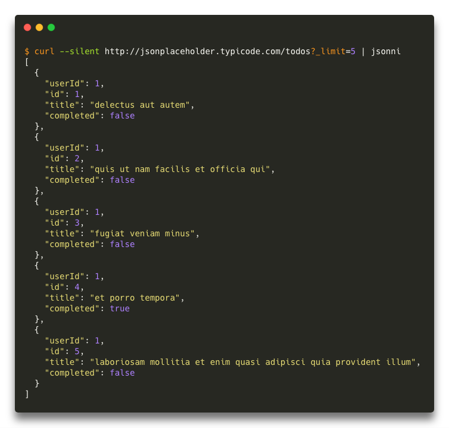

#  JSONNI

[![Sponsored](https://img.shields.io/badge/chilicorn-sponsored-brightgreen.svg?logo=data%3Aimage%2Fpng%3Bbase64%2CiVBORw0KGgoAAAANSUhEUgAAAA4AAAAPCAMAAADjyg5GAAABqlBMVEUAAAAzmTM3pEn%2FSTGhVSY4ZD43STdOXk5lSGAyhz41iz8xkz2HUCWFFhTFFRUzZDvbIB00Zzoyfj9zlHY0ZzmMfY0ydT0zjj92l3qjeR3dNSkoZp4ykEAzjT8ylUBlgj0yiT0ymECkwKjWqAyjuqcghpUykD%2BUQCKoQyAHb%2BgylkAyl0EynkEzmkA0mUA3mj86oUg7oUo8n0k%2FS%2Bw%2Fo0xBnE5BpU9Br0ZKo1ZLmFZOjEhesGljuzllqW50tH14aS14qm17mX9%2Bx4GAgUCEx02JySqOvpSXvI%2BYvp2orqmpzeGrQh%2Bsr6yssa2ttK6v0bKxMBy01bm4zLu5yry7yb29x77BzMPCxsLEzMXFxsXGx8fI3PLJ08vKysrKy8rL2s3MzczOH8LR0dHW19bX19fZ2dna2trc3Nzd3d3d3t3f39%2FgtZTg4ODi4uLj4%2BPlGxLl5eXm5ubnRzPn5%2Bfo6Ojp6enqfmzq6urr6%2Bvt7e3t7u3uDwvugwbu7u7v6Obv8fDz8%2FP09PT2igP29vb4%2BPj6y376%2Bu%2F7%2Bfv9%2Ff39%2Fv3%2BkAH%2FAwf%2FtwD%2F9wCyh1KfAAAAKXRSTlMABQ4VGykqLjVCTVNgdXuHj5Kaq62vt77ExNPX2%2Bju8vX6%2Bvr7%2FP7%2B%2FiiUMfUAAADTSURBVAjXBcFRTsIwHAfgX%2FtvOyjdYDUsRkFjTIwkPvjiOTyX9%2FAIJt7BF570BopEdHOOstHS%2BX0s439RGwnfuB5gSFOZAgDqjQOBivtGkCc7j%2B2e8XNzefWSu%2BsZUD1QfoTq0y6mZsUSvIkRoGYnHu6Yc63pDCjiSNE2kYLdCUAWVmK4zsxzO%2BQQFxNs5b479NHXopkbWX9U3PAwWAVSY%2FpZf1udQ7rfUpQ1CzurDPpwo16Ff2cMWjuFHX9qCV0Y0Ok4Jvh63IABUNnktl%2B6sgP%2BARIxSrT%2FMhLlAAAAAElFTkSuQmCC)](http://spiceprogram.org/oss-sponsorship)

Manipulate data with ES6, [Lodash](https://lodash.com/) or [fromfrom](https://github.com/tomi/fromfrom), on command line.

Command line version of [JSONNI](https://github.com/hannupekka/jsonni)

## Install

`npm install -g jsonni-cli`

## Usage

```
Usage: jsonni [options]

Options:
  -v, --version            output the version number
  -i --indent <indent>     output indentation, defaults to "  "
  -m --minify              minify output
  -q --query <query>       query to transform data with
  --csv                    use CSV as input data
  --tsv                    use TSV as input data
  --delimiter <delimiter>  CSV/TSV delimiter character. Defaults to ";"
  --headers <headers>      CSV/TSV headers, indicates that input does not have headers. Separated with ","
  -h, --help               output usage information

Examples:
  $ cat data.json | jsonni
  $ cat data.json | jsonni -q '$input.map(i => i.name)'

  $ cat data.csv | jsonni --csv
  $ cat data.csv | jsonni --csv --delimiter=','
  $ cat dataWithoutHeaders.csv | jsonni --csv --headers=_id,isActive,age,name,registered

  $ cat data.tsv | jsonni --tsv
  $ cat dataWithoutHeaders.tsv | jsonni --tsv --headers=_id,isActive,age,name,registered
```

## Examples



### Parsing CSV


### ES6


### Lodash


### fromfrom


## Acknowledgements

This project is a grateful recipient of the [Futurice Open Source sponsorship program](http://futurice.com/blog/sponsoring-free-time-open-source-activities).

Icon made by [Freepik](https://www.flaticon.com/authors/freepik) from [www.flaticon.com](https://www.flaticon.com)

## License

MIT
